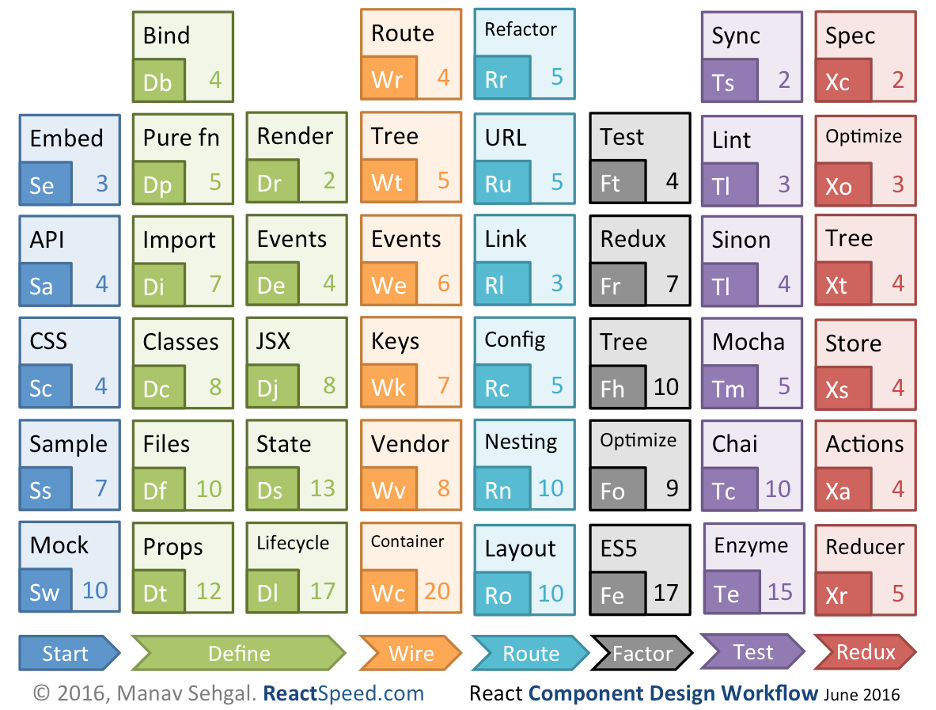

# Component Design Workflow

Our component design workflow, from prior chapters, defines seven high level stages.

1. **Start** component design.
2. **Define** component internals.
3. **Wire** multiple components.
4. **Route** component layouts.
5. **Refactor** existing components.
6. **Test** app components.
7. **Redux** state container.

We can form a **Periodic Table** of React Component Design workflow. This infographic serves
few objectives.

- It organizes the entire React component design workflow in one place.
- Serves as a memory aid using symbols to represent workflow stages and strategies.
- The numbers are indicative of steps necessary to achieve a strategy.
- Sequence of the stages from left to right indicate the ideal development workflow.
- Higher order strategies (at the top) normally link to next stage in the workflow.
- Provides a linear learning path to almost entire React ecosystem.

You can download a higher resolution version of this infographic at [ReactSpeed.com][1] website.

## Start component design (S)

The objective at this stage is to speedily "prototype" new features and code within your React project.

Strategies to start component design include the following.

- Designing React components rapidly from samples available on the Web. (Ss)
- Using Web Embeds like YouTube, Flickr, Twitter, to create React components. (Se)
- Converting CSS libraries into React components. (Sc)
- Integrating third-party REST APIs to start creating React components. (Sa)
- Moving from a wireframe to a React component. (Sw)

## Define component internals (D)

This workflow does a deep dive into best practices for defining your React component internals.

- Naming files, folders, and modules. (Df)
- Imports and exports. (Di)
- Stateless components and pure functions. (Dp)
- Classes and inheritance. (Dc)
- Constructor and binding. (Db)
- Properties and property types. (Dt)
- State management. (Ds)
- Lifecycle methods. (Dl)
- Event handlers. (De)
- Render and ReactDOM.render methods. (Dr)
- JSX features and syntax. (Dj)

## Wire multiple components (W)

React is all about composition of multiple components. This workflow highlights
best practices in deciding how to design for inter-related multiple components
in your project.

You will apply following strategies in this important workflow.

- Events in multiple components. (We)
- Composition using parent child node tree. (Wt)
- When to use presentational verses container components. (Wc)
- Reconciliation algorithm and keys for dynamic children. (Wk)
- Integrating vendor components. (Wv)
- Routing to wire component layouts. (Wr)

## Route component layouts (R)

For complex apps you may want to use multiple layouts. In order to switch from
one layout to another using links or page URLs, we will use routing.

- Learn about component layout and organization strategies. (Ro)
- Search engine friendly URLs using Routing. (Ru)
- Refactoring layouts with routing. (Rr)
- Routing for nesting components. (Rn)
- Handling router exceptions. (Re)
- Using Link from React Router. (Rl)
- Configuring app routes. (Rc)

## Refactor existing components (F)

Refactoring is an essential part of iterative development. React is ideal for iterative
refactoring of your code because of component based development.

Follow strategies apply when considering refactoring your React code.

- Refactoring to render node children or component hierarchy tree. (Fh)
- ES5 to ES6 React component definition. (Fe)
- Testing and refactoring. (Ft)
- Refactoring for converting standard React app to Redux. (Fr)
- Refactoring for optimizing React apps. (Fo)

## Test app components (T)

This workflow will walk you through multiple testing tools and strategies to make your
React app more reliable, robust, and performant.

We will apply following strategies as part of this workflow.

- Browsersync multi-device testing. (Ts)
- JavaScript lint using ESLint and CSS lint using StyleLint. (Tl)
- Mocha Behavior-Driven Development. (Tm)
- Chai assertions. (Tc)
- Enzyme React component testing. (Te)
- Sinon spy methods and events. (Ts)
- Istanbul test coverage. (Ti)

## Redux state container (X)

React is the *View* for your app. We need an equally elegant solution for
managing the *State* and *Data Flow* within your app. This becomes even more important
concern for Single Page Apps as efficient state management leads to performant
user experience. This is where Redux steps in.

Redux applies following strategies when creating your React apps.

- State tree definition. (Xt)
- Actions to update Redux store. (Xa)
- Reducers to define changes to the store based on actions. (Xr)
- Store for managing state of your app in one place. (Xs)
- Optimizing Redux apps. (Xo)
- Specifying and testing Redux components. (Xc)

[1]: https://reactspeed.com/blog/periodic-table
